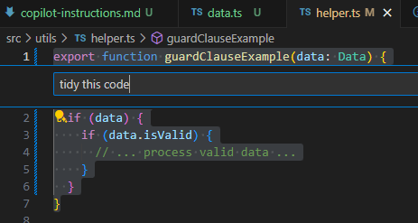

# Tidyings Copilot Node.js Application

This repository contains a Node.js application that demonstrates various "tidyings" generated by GitHub Copilot. The application includes a set of GitHub Copilot's custom instructions that focus on improving code readability and maintainability based on the book [Tidy First](https://www.google.com.au/books/edition/_/-WndEAAAQBAJ?hl=en&gbpv=0) by Kent Beck.



## Tidy First by Kent Beck

"Tidy First?: A Personal Exercise in Empirical Software Design" by Kent Beck focuses on the practice of "tidying" code to improve its readability and maintainability. Here's a breakdown of the book's core concepts:

* **Tidying Code:**
    * The book emphasizes making small, incremental changes to the structure of code without altering its behavior.
    * These "tidyings" aim to make the code easier to understand and work with.
    * Examples include extracting code into helper functions, using guard clauses, and improving code organization.
* **When to Tidy:**
    * A key aspect of the book explores when to apply these tidyings: before, during, or after making changes to the code's behavior.
    * It delves into the strategic decisions behind when to prioritize tidying.
* **Why Tidy:**
    * The book explains how tidying contributes to better software design by reducing coupling, increasing cohesion, and preserving options for future changes.
    * It connects these principles to broader concepts like optionality and the economic value of maintainable code.
* **Practical Guidance:**
    * The book provides practical advice and examples to help developers implement tidying techniques in their daily work.
    * It encourages developers to think of software design as an exercise in human relationships, because code is read by humans.

In essence, "Tidy First?" offers a pragmatic approach to improving code quality through consistent, small adjustments, with a strong emphasis on the timing and rationale behind those adjustments.

## GitHub Copilot Custom Instructions

To enhance your development experience with GitHub Copilot, you can add custom instructions to guide the AI in generating code that aligns with the principles of "Tidy First?" by Kent Beck. Here are some examples:

* **Add Guard Clause:**
    * Instruction: "Add a guard clause to handle null or undefined values at the beginning of the function."
* **Extract Helper Function:**
    * Instruction: "Extract this block of code into a helper function to improve readability."
* **Introduce Explaining Variable:**
    * Instruction: "Introduce a variable to explain the purpose of this complex expression."
* **Simplify Conditional:**
    * Instruction: "Simplify this conditional statement to make it more readable."
* **Refactor to Use Early Return:**
    * Instruction: "Refactor this function to use early return for better readability."

## Getting Started

To get started with this application, follow these steps:

1. **Clone the repository**:

   ```pwsh
   git clone https://github.com/dneimke/tidyings.git
   cd tidyings
   ```

2. **Compile TypeScript files**:

   ```pwsh
   npx tsc
   ```

3. **Run the application**:

   ```pwsh
   node dist/index.js
   ```

## Usage

You can modify the `src/index.ts` file to test various Copilot custom instructions. For example, the `guardClauseExample` function in `src/utils/helper.ts` demonstrates how to use guard clauses to handle invalid data:

```typescript
export function guardClauseExample(data: Data) {
    if (!data) return;
    if (!data.isValid) return;
    // ... process valid data ...
}
```

Feel free to use and modify these utility functions to explore different tidying techniques.

## Contributing

Feel free to submit issues or pull requests if you have suggestions or improvements for the application.

## License

This project is licensed under the MIT License.
